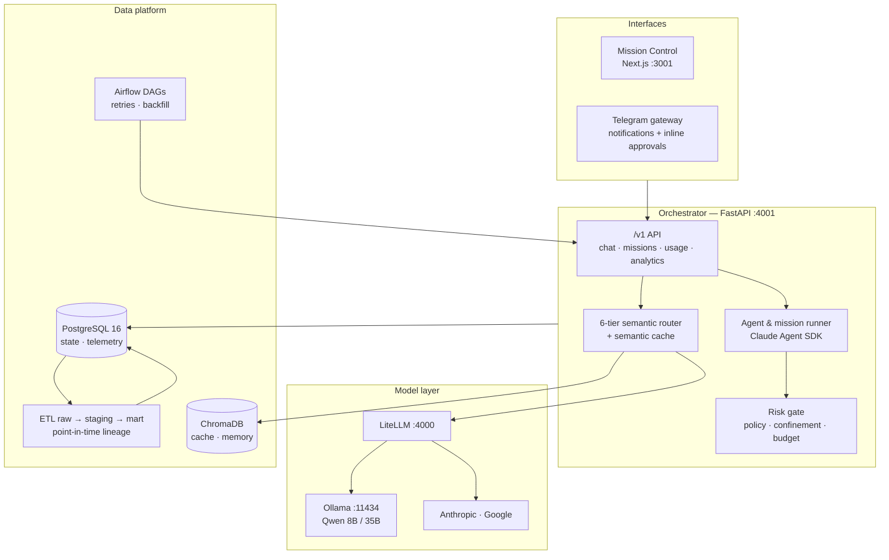

# Kage

**A self-hosted Python platform that orchestrates, governs and evaluates AI workflows.**

Kage routes every request to the right model, keeps its own state and telemetry in PostgreSQL,
turns that telemetry into analytics through a raw → staging → mart pipeline, schedules its batch
work with Airflow, and refuses to let an autonomous agent do anything irreversible without an
explicit approval.

`Python 3.12` · `FastAPI` · `PostgreSQL 16` · `Airflow` · `ChromaDB` · **576 tests** · CI on every push to `dev`

**Security:** [OWASP GenAI / LLM Top 10 (2026) mapping](docs/SECURITY-LLM-TOP10.md) · [Detection lab — Sentinel + MITRE ATT&CK](docs/lab-azure-sentinel/)

---

## Why it exists

Most personal AI tooling is a thin wrapper around one model. That breaks down the moment you
want an agent to actually *do* things: you need to know what it did, what it cost, whether it
followed the rules, and how to stop it. Kage is built around those four questions.

The design bias throughout: **make behaviour inspectable and measurable rather than asserted.**
An agent that claims it followed the rules is not evidence. A run ledger, a regression benchmark
and a fail-closed approval gate are.

---

## Architecture



---

## What's inside

### Data platform

- **PostgreSQL 16** holds shared state and telemetry across processes — 7 tables (`usage`,
  `runs`/`run_events`, `missions`/`mission_wps`, `job_runs`, `scheduled_tasks`, `status`),
  hand-written SQL over `psycopg`, no ORM. Chat history and single-process tables stay in SQLite,
  deliberately: migrating them would not remove any pain.
- **Idempotent cutover.** The migration off lock files and SQLite verifies row counts *inside the
  same transaction* and raises on mismatch, so a partial migration rolls back to nothing. Sources
  are never deleted — they remain archives.
- **ETL pipeline** (`etl.py`) — raw → staging → mart, entirely in SQL. Staging rows carry
  point-in-time lineage (`event_time`, `available_time`, `ingested_time`, `source`); mart rows
  carry the `dataset_snapshot_id` of the run that produced them. Processing unit is a **day**, so
  idempotency is local and provable: re-running a day yields exactly the same rows.
- **Airflow** (`airflow/dags/`) owns the non-safety-critical batches — nightly ETL aggregation,
  backup, job scan, weekly trading calibration — for retries, backfill and history. Fail-closed
  near-real-time jobs (trading killswitch, heartbeat) stay in-process on purpose.

### Routing and cost

- **6-tier router** — local Qwen 8B/35B for fast and reasoning work, Claude and Gemini above.
  Tier selection is semantic (embeddings) with a classifier and heuristic fallback.
- **Semantic cache** over ChromaDB, so near-identical questions never reach a model.
- **Daily budget** with a hard cap on cloud calls and an inline warning before it bites.

### Governance

- **Risk gate** (`risk_hook.py`) — a PreToolUse hook scoring every tool call on reversibility,
  explicit intent and content. High-risk calls block until approved via inline Telegram buttons.
- **Workspace confinement** — task working directories are canonicalised (`resolve()`, so `..`
  and symlinks don't help) and checked against an allow-list before any subprocess starts.
- **Kill switch** — `!stop` halts every agent and pauses the scheduler.

These controls are documented against an external standard rather than asserted:

**[OWASP GenAI / LLM Top 10 (2026) — architecture mapping](docs/SECURITY-LLM-TOP10.md)** maps each
of the ten risks to a concrete control with line-level code references, and closes with eight
limitations the architecture does *not* cover — including the places where it fails open.

**[Detection lab — risk-gate telemetry in Microsoft Sentinel](docs/lab-azure-sentinel/)** takes 481
real policy decisions from 20 days of use, ships them into Azure Log Analytics, and adds three KQL
detection rules mapped to MITRE ATT&CK — with the tuning decision that separates a usable rule
from one an analyst would mute.

### Evaluation

- **KageBench** (`kagebench.py`) — a regression gate that runs fixed tasks in a clean worktree and
  records success, cost, latency, turns, tool calls and approval requests, then diffs against the
  previous report. Deliberately not part of every commit: run it before a large change.

---

## Testing and CI

```bash
source .venv/bin/activate && pytest
```

**576 tests** across routing, budget, confinement, memory, backup/restore, ETL, PostgreSQL store,
Airflow batches, missions and end-to-end HTTP. [GitHub Actions](.github/workflows/ci.yml) runs the
suite against a real `postgres:16` service on every push and PR to `dev`.

---

## Quick start

```bash
git clone https://github.com/st3fansrb/kage.ai.git
cd kage.ai
bash scripts/setup.sh
```

Edit `kage_config.json` (created from the example by `setup.sh`), then:

```bash
bash start_all.sh
```

Mission Control opens at **`http://localhost:3001`**. Pull the local models once:

```bash
ollama pull qwen3:8b
ollama pull qwen3.6:35b
ollama pull nomic-embed-text
```

Requirements: Python 3.12, [Ollama](https://ollama.ai), PostgreSQL 16,
[Claude CLI](https://docs.anthropic.com/claude-code) for agent tasks. Full instructions:
[docs/INSTALL.md](docs/INSTALL.md) · restoring from backup: [docs/RESTORE.md](docs/RESTORE.md)

---

## API surface

Versioned under `/v1`, token-authenticated:

| Endpoint | Purpose |
|---|---|
| `POST /v1/chat/completions` | OpenAI-compatible, streaming and non-streaming |
| `GET /v1/missions` · `POST /v1/missions` | List and create autonomous missions |
| `GET /v1/usage` | Paginated usage and cost telemetry |
| `GET /v1/analytics/daily` | Mart-level daily aggregates |
| `GET /health` · `GET /api/stats` | Liveness and live counters |
| `POST /admin/backup` · `POST /admin/etl` | Operational triggers (backup, ETL backfill) |

---

## Chat prefixes

Messages without a prefix go through an intent router; prefixes remain the deterministic bypass.

| Prefix | Effect |
|---|---|
| `!fast` · `!best` · `!opus` | Force Tier 1 (local) / Tier 5 (Sonnet) / Tier 6 (Opus) |
| `!plan` · `!retry` · `!nocache` | Minimum Tier 2 · escalate one tier · skip the cache |
| `!run` · `!sysrun` | Autonomous agent task, with or without orchestrator context |
| `!mission new` · `!mission start <slug>` | Draft a mission plan for approval · run it autonomously |
| `!save [path]` · `!schedule "CRON" msg` | Save the answer to the vault · add a scheduled task |
| `!scan [profile]` · `!briefing` | Job-hunter scan · daily digest |
| `!status` · `!stop` · `!resume` · `!help` | Snapshot · kill switch · resume scheduler · this list |

---

## Documentation

- [docs/DESPRE_KAGE.md](docs/DESPRE_KAGE.md) — what Kage is and does (Romanian)
- [docs/ROADMAP.md](docs/ROADMAP.md) — phase history and scope decisions
- [docs/SECURITY-LLM-TOP10.md](docs/SECURITY-LLM-TOP10.md) — **OWASP GenAI / LLM Top 10 (2026)** mapping, with what is *not* covered
- [docs/lab-azure-sentinel/](docs/lab-azure-sentinel/) — **detection lab**: risk-gate telemetry in Microsoft Sentinel, 3 KQL rules mapped to MITRE ATT&CK

---

## License

[AGPL-3.0](LICENSE) — free for personal and open source use.

For commercial use (hosted service, closed-source product) without AGPL obligations:
contact `stefan.andrei.sirbu@gmail.com`
